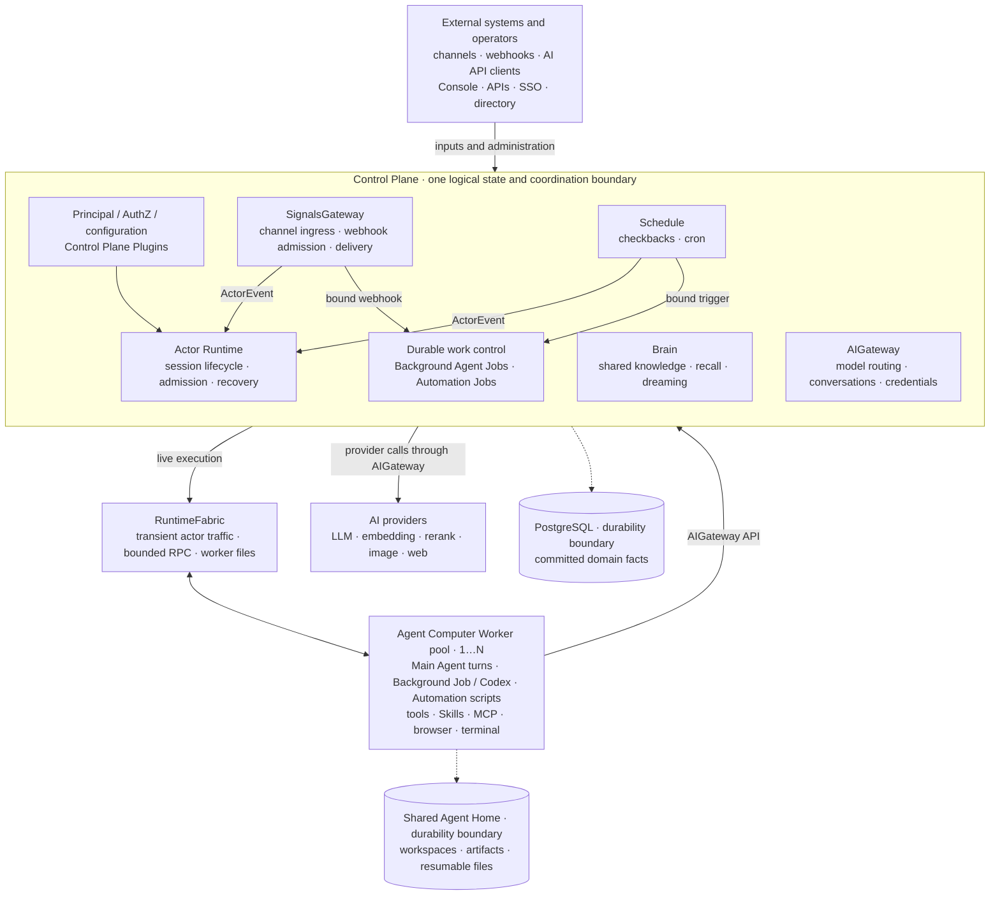

# SerapeumOS

SerapeumOS is an independent public open-source downstream project currently
based on Ankole v1.0.4-rc.1.

Qualified foundation: `7434d934315881438d4788d41228ba31d2f26fbb`

Project status: pre-implementation / architecture and governance bootstrap.

The inherited Ankole README continues below for foundation documentation.

---

# Ankole, the enterprise Agent Harness with a Company Brain

[](LICENSE)


[](https://deepwiki.com/AgentBull/ankole)

[简体中文](./README.zh-Hans.md) | [日本語](./README.ja.md) | [한국어](./README.ko.md)

[Why Ankole](#why-ankole) · [Company Brain](#company-brain) · [Decision work](#decision-work) · [Enterprise runtime](#enterprise-runtime) · [Architecture](#architecture) · [Current status](#current-status) · [Development](#development)

**Give your company a Brain and every Agent better judgment.**

Ankole is the open source Claude Tag alternative for company work. Its enterprise Agent Harness assembles company knowledge, live signals, permissions, tools, and observed results into the context an Agent needs to make a decision and show its evidence.

Company Brain gives durable Agents shared knowledge. The Harness applies enterprise authority and carries work across model calls.

A model can reason only over the context it receives. Ankole selects the relevant facts and capabilities, enforces authority, preserves work through failure, and records results for later decisions.

Ankole runs on infrastructure that the company controls. Identity, context, credentials, artifacts, audit records, and execution stay in that environment.

The Harness gives each model call continuity, authority, durable state, and feedback from results.

## Why Ankole

Most Agent stacks combine a model, a prompt, and a set of tools. Each call begins with context assembled for that moment. Ankole maintains the company state and runtime required for work that continues after the call.

- The Harness assembles current context, selects capabilities, enforces authority, and preserves state across model calls.
- Messages, schedules, webhooks, market changes, and internal events can wake the right Agent.
- Stable identities, AuthZ, approval points, audit records, and delivery state define the authority of each Agent.
- Corrections, new evidence, expired facts, and observed outcomes update the context for later decisions.

## Company Brain

Company Brain gives every authorized Agent access to the same current company knowledge.

It learns from conversations, registered files and URLs, and deliberate Agent writes. Every claim keeps its source, time, holder, confidence, and audience.

- A judgment stays attached to its holder, and each source stays attached to the claim it supports.
- New evidence updates the current view while preserving the history of earlier decisions.
- Contradictions remain visible for review.
- Recall applies Principal and group visibility before protected knowledge reaches a model.
- Dreaming organizes evidence, finds patterns, grades due predictions, and proposes changes for human approval.

## Decision work

Ankole supports decisions with explicit assumptions and observable outcomes. Current examples include industry research, product selection, deep data analysis, and forecasting.

- The Agent starts with current rules, prior decisions, relevant evidence, available authority, and recent changes.
- Deep Research divides evidence gathering across independent workers, tests competing hypotheses, records evidence gaps, and returns a cited report.
- A browser, terminal, files, models, and connected systems let the Agent investigate and act within its authority.
- Predictions, corrections, and observed outcomes become evidence for later decisions.

## Enterprise runtime

Ankole runs each active session as an addressable Virtual Actor. The actor can wake, receive messages, checkpoint, stream progress, hibernate, recover, and continue.

Five mechanisms keep the work alive and accountable:

- A Virtual Actor gives each session an address, mailbox, lifecycle, and recovery path.
- OTP supervision trees isolate a session that hangs, times out, or crashes.
- ZeroMQ carries wakeups, steering, checkpoints, streams, and backpressure with low latency.
- Agent Computer runs the model loop, tools, files, terminal state, and streaming output close to the workspace.
- PostgreSQL keeps mailboxes, turns, reminders, decisions, and committed actions for recovery and audit.

Agents can work for hours or days, receive input while running, fail independently, recover with context, and record committed effects. The [runtime design article](https://ding.ee/en-US/why-otp-is-a-better-runtime-for-multi-agent-orchestration/) explains the role of OTP in detail.

## Architecture

This diagram shows the boundaries for ownership and durability. Internal calls are omitted.



The Elixir/OTP control plane owns durable decisions for Principal/AuthZ, SignalsGateway, Schedule, Actor Runtime, Job lifecycles, Brain, and AIGateway. PostgreSQL stores their domain facts.

- SignalsGateway owns channel and webhook admission. Schedule owns checkbacks and cron.
- Agent Computer Workers run Main Agent turns, Background Job and Codex turns, and Automation scripts.
- RuntimeFabric carries transient actor traffic, bounded RPC, and worker file operations.
- AIGateway routes LLM, embedding, rerank, web search, and web fetch requests through one control plane boundary.
- Brain stores shared pages and claims. Every read applies the knowledge boundary of the requesting Principal.
- Background Agent Jobs support interactive model work. Automation Jobs run deterministic scripts owned by an Agent.
- Shared Agent Home stores workspaces, artifacts, and resumable files. Worker process state can be rebuilt.

## Current status

Ankole runs in production as a complete enterprise Agent Harness. Companies can host the control plane, Agent Computer, kernel, and operator console on their own infrastructure.

- OpenAI, Azure OpenAI, Claude, Google AI Studio, OpenRouter, and other endpoints compatible with the OpenAI API support compaction, stateful conversations, reasoning effort control, and provider usage records.
- Lark/Feishu and Slack integrations have dedicated coverage for lifecycle, transport, main flows, and real LLM calls.
- Brain provides scoped disclosure, conversation and source learning, offline consolidation, operator review, full text search, and vector search.
- Sessions wake, checkpoint, stream progress, hibernate, recover with context, and accept live steering or cancellation.
- The operator console included with Ankole manages Agents, library settings, plugins, providers, models, identity, signals, Workers, Brain knowledge, and Background Agent Jobs.
- Unit suites and dedicated system suites cover scheduling, Worker computers, recovery under failure, concurrency, and performance.

Ankole is still defining its public API compatibility contract. Releases can include breaking changes.

| Area | Status |
| --- | --- |
| Control plane | Phoenix/OTP application under `app/control_plane`. Owns durable state, configuration, actor orchestration, Principal/AuthZ, AIGateway, Brain, SignalsGateway, and operator APIs. |
| Agent Computer | Bun/TypeScript Worker runtime under `app/agent_computer`. Runs the Agent loop and local tools inside an isolated Linux Worker image. Its supported role is Worker execution. |
| Kernel | Rust crate under `app/kernel`, loaded by Elixir (Rustler) and Bun (N-API) for crypto, identifiers, AuthZ evaluation, and ZeroMQ transport. |
| Frontend | Vite + React console, auth, and setup surfaces under `app/webapps`, built into the Phoenix static shell. |
| Local services | PostgreSQL is provided through the devkit Docker Compose setup. |
| Design docs | Architecture and runtime design documents live under `docs/design-docs`. |
| Production readiness | Running in production. State persistence, live control, and operator interfaces are complete. Ankole is still defining its public API compatibility contract. |

## Current repository

This repository is the active Ankole control plane and runtime workspace.

- `app/control_plane` - Phoenix/OTP control plane for Principal/AuthZ, AppConfigure, setup, console, the Control Plane Plugin registry, I18n, SignalsGateway, actor runtime, RuntimeFabric, and durable state in PostgreSQL.
- `app/kernel` - shared Rust foundation loaded by Elixir and Bun for crypto, identifiers, phone/JWT helpers, AuthZ evaluation, protobuf envelopes, and ZeroMQ RuntimeFabric transport.
- `app/agent_computer` - Bun + TypeScript Agent Computer worker for the local LLM loop, provider adapters, tools, skill loading, files, terminal state, and worker daemon.
- `app/webapps` - Vite + React frontend applications for auth, setup, and console surfaces, built into the Phoenix static shell.
- `app/library` - bundled Skills, Agent Plugins provided by Ankole, and starter templates such as `MISSION.md` and `SOUL.md`.
- `app/locales` - shared TOML translation catalogs consumed by the control plane and browser surfaces.
- `libs/uikit` - shared UI primitives for Ankole webapps.
- `libs/feishu_openapi` - local Lark/Feishu OpenAPI client library.
- `libs/slack_openapi` - local Slack Web API, Socket Mode, and OIDC client library.
- `internals/plugins` - private Control Plane Plugin code compiled into private releases.
- `tools/devkit` - workspace automation for local services, app database helpers, code generation, and analysis.
- `docs/design-docs` - current design documents for principal identity, authorization, configuration, I18n, plugins, RuntimeFabric, SignalsGateway, and provider adapters.

RuntimeFabric carries live traffic from the control plane to Workers. It moves actor traffic, bounded RPC, and Worker file frames over ZeroMQ. PostgreSQL owns durable replay, fences, reconciliation, and final commits.

SignalsGateway receives provider traffic. It converts external chats, webhooks, and provider events into actor events while preserving the source facts.

## Development

Ankole defaults to Bun for workspace scripts and Elixir/Phoenix for the control plane.

For a first local setup, copy this single prompt into a coding agent:

```text
Read https://github.com/AgentBull/ankole/blob/main/CONTRIBUTING.md in full, then guide me through a complete local Ankole setup and its documented verification from entry to result. Treat that guide as the source of truth. Perform and verify every safe reversible step. Pause for actions that require a human account, secret, OAuth flow, or approval for a destructive step. Declare completion only after its success criteria pass.
```

```shell
bun install

# Local support services and workspace helpers
bun kit --help
bun services:start
bun services:status

# Control plane
bun control-plane:setup
bun control-plane:dev
bun control-plane:test

# Agent Computer container image and tests
bun agent-computer:test
bun agent-computer:type-check

# Other Bun packages
bun webapps:build
bun feishu-openapi:test
```

Agent Computer is designed to run as a Linux container runtime. For strong
bubblewrap command isolation, run Docker with `--cap-add SYS_ADMIN`,
`--security-opt seccomp=unconfined`, and
`--security-opt systempaths=unconfined` unless you provide an equivalent custom
seccomp/profile setup. In Kubernetes, put the equivalent
`capabilities.add: ["SYS_ADMIN"]`, `seccompProfile`, and `procMount: Unmasked`
on the Agent Computer container `securityContext`. If strong bubblewrap is
unavailable, the worker may downgrade to weak bubblewrap (container `/proc`
mounted into bwrap) and emits a startup warning. It never exposes model commands
without a sandbox.

Run checks for each affected package:

```shell
bun run --filter @ankole/control-plane test
bun run agent-computer:test
bun run --filter @ankole/agent-computer type-check
bun run --filter @ankole/webapps type-check
bun run --filter @ankole/feishu-openapi test
```

Once the control plane is running, the worker bootstrap helper renders the Docker command used to start an external Agent Computer worker against the local RuntimeFabric endpoint:

```shell
cd app/control_plane
mix ankole.actor_runtime.worker_bootstrap --endpoint tcp://127.0.0.1:6010 --worker-id worker-a
```

Production bootstrap configuration uses standard infrastructure names such as `DATABASE_URL` and `SECRET_KEY_BASE`. Store runtime application configuration in the AppConfigure records in PostgreSQL.

Brain requires PostgreSQL with `pg_search` preloaded and the `pg_search`,
`vector`, and `pg_trgm` extensions available; the BrainV3 migration installs
them. `tools/devkit/postgres-for-ankole` builds a matching image.
